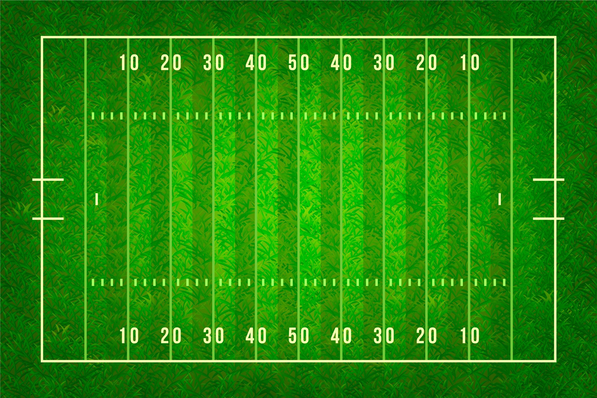
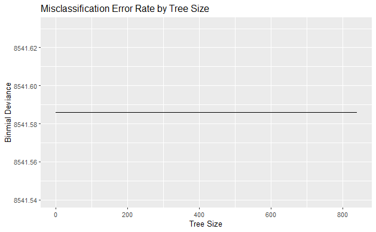
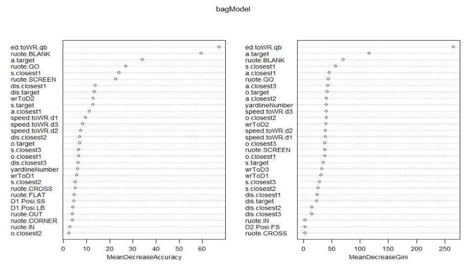
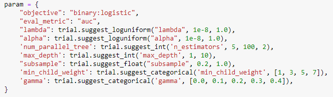
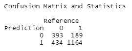

\fontsize{12}{22}
\selectfont

```{r setup, include=FALSE}
knitr::opts_chunk$set(echo = FALSE,tidy = TRUE,fig.align = 'center')
#setwd("/Users/Rohit/Documents/F2022/Stat 441/Project")
```


\pagebreak

# Executive Summary


This report uses NFL Big Data Bowl 2021 data to classify passes in American Football as "Good"/"Bad". This classification is made based on whether or not the pass was successful. To train our models, we use the offensive team's players' movement data up to the point the pass was made, as well as the positions of some key defenders.

This study compares several models in classifying the pass result based on the tracking data. The top 2 models to highlight are [ModelName 1] and [ModelName 2]. Their test error rates are [Percentage 1] and [Percentage 2]. The best tuning parameters for [ModelName 1] are [List of Tuning Param], and the best tuning parameters for [ModelName 2] are [List of Tuning Param]. Other models considered include [List of Models], and their performance details are discussed in the appendices. 

This report concludes that the best classification model is [ModelName]. Additional work needs to be done to incorporate the tracking data of more players as well as including individual player data into the models.


\pagebreak

# Introduction

Gridiron Football, also known as American Football (and hereafter simply referred to as football) is on of the most popular sports in North America. It is played as a contest between 2 teams of 11, with the aim being to score as many points as possible. Teams can score points by either advancing the ball into the opposing teams' end-zone, or by kicking the ball through the opponents' goal posts.

```{r fig.cap="Football Field Illustration", fig.pos="H",out.width="250px",fig.align='center'}

```

As with many other contemporary sports, football has undergone a data revolution. With the development of new technology it is now possible to collect vast amounts of data in real time, and use that data to analyze the flow and progression of the game. Each players' exact location, direction of movement and field of vision can be precisely captured for the duration of the game. This data can be leveraged to identify strengths and weaknesses in the teams' plays, and choose optimal strategies. The dataset chosen by us for this project is from an annual competition knows as the NFL data bowl. While the specifics change each year, the organizers provide participants with real second-by-second data from the previous season of the NFL. The participants must come up with novel and useful ways to use this data to provide insight into the performance of the teams in the NFL.

\pagebreak

# Problem of Interest

In a game of football, the single most important role is the quarterback, this is a fact that can be proved by the average salary across all positions. Thus it is clear that in order to be successful, a team must have a high quality quarterback. In our study, we wish to construct a way to analyze quarterbacks. We believe that the most important aspect of ability for a quarterback is to pass the ball, more specifically, passing to a wide receiver. This is a task that can potentially convert to a instant touch down. We use varies machine learning algorithm to predict the result of a QB-passsing-to-WR play. When there exist a mismatch between the actual pass result and our prediction, it is a sign that something happened during the play that need further investigation. It might be that the QB simply threw a bad pass, or that there is a lack of synergy between the quarterback and the wide receiver. Our models can be further expand to perform live prediction during the games to help audience better understanding the game.

\pagebreak

# Methods

## GLM Net and Logistic Regression
We used logistic regression as a starting point of the modelling process since it is based on simple linear model and gives binary outcome: complete or incomplete pass. Since the original dataset contains around 40 predictors, model regularization is necessary to avoid overfitting and variance inflation caused by multi-collinearity. We used elastic net to select variables and maintain grouping effects for pairwise correlated variable groups (Hastie, 2005). Building a GLM Net model involves selecting 2 tuning parameters: alpha and lambda. Lambda scales the $L_1$ and $L_2$ penalty terms, while $\alpha$ distribute different weights to  $L_1$ and $L_2$ penalty terms. We selected $\alpha$ and $\lambda$ in the following way (Andreis, 2017):
1. Supply a grid of $\alpha$ ranging from 0 to 1, with each step be 0.1.
2. For each $\alpha$ in the grid, apply `cv.glmnet()` to find the suitable lambda and associated binomial deviance.
3. Store the $\alpha$-$\lambda$ pair and deviance in a data frame, choose the pair that yields as least deviance as the tuning parameter to train the final model.

At the second, step, 1-standard-error rule is used to choose the best lambda, this helps use simpler models to yield the similar test performance as more complex models (Hastie, 2021).  

## Single Tree Predictor
A full tree was grown based on all predictors in the dataset. The full tree was passed to `cv.tree()` choose the best size of tree and the multiplier k to the scalar. The tree size and scalar k that first settle the negative log likelihood to a stable level is chosen to build the final tree for testing. Gini index was used to make tree splits.  

## Random Forest and Bagging
Random forest bagging draw bootstrap samples from the training set and build tree predictors for each bootstrap samples. `randomForest()` from randomForest package was used to build both models. By default, 500 trees were grown for each predictor, and out-of-bag error (OOB) and test error were plotted against the number trees for each predictor. Since the plots are fuzzy curves, we picked the number of trees that roughly settled the OOB error to be build the final model. The random forest randomly drew `r floor(sqrt(37))` predictors to make splits in trees, while the bagging method used all predictors to make splits. Variable importance was plotted for both predictors. The maximum of nodes is inherited from the single tree predictor.

## Ada Boosting
Ada Boosting iteratively re-weights of observations based on training error rate and log odd ratio.The number of iteration is 500, shrinkage parameter was 0.01, interaction depth was 4. The model used 10-fold cross validation to calculate generalization error. Variable importance plot and deviance-iteration plot were graphed.

The test error rate, sensitivity, specificity of above-said models were summarized by a table. ROC curves were plotted to and put together in one plot. The top 2 models with the lowest test error rate and highest area under ROC curve were discussed in detail in Results section. The other models' details can be found in appendices.  

## XGBoost

XGBoost is one of the most used Machine Learning algorithm in the data science industry as well as competitions. The Python package Optuna was used to perform the hyperparameter tuning for its power and efficiency. 

The objective function used is the binary logistic objective function, which is also known as the log-loss function:

\begin{equation}
yln(p) + (1-y)ln(1-p) \quad where \quad p = \frac{1}{1+e^{-z}}
\end{equation}

\pagebreak

## Hyperparameter tuning

### GLMNET logistic regression

We use cross-validation to choose the optimal values of $\alpha$ and $\lambda$ to use while fitting the GLMNET model. Searching a grid of $\alpha$ and $\lambda$ values gives us that the optimal values are $\alpha=1,\lambda=0.00465$  
  
### Single Tree
Next, we try to fit individual trees to the dataset. We let the size of the tree vary, and optimize for the ideal tree size.
```{r fig.cap="Binomial Deviance vs. Tree size",out.width="300px",fig.pos="H"}

```

It seems like the size of the tree has no impact on the binomial deviance. The prediction power is also very weak. As a result, we will not be using individual trees to make predictions

### Random Forest and Bagging

Now, we fit random forests on the dataset. We let the number of trees in the random sequence vary and optimize for the best number of trees in the sequence.
```{r out.width="300px",fig.cap="Error Rate vs. Number of Trees in Sequence",fig.pos="H"}
knitr::include_graphics("Images/Forest OOB and Test Error.png")
```
The plot suggests that using 100 random trees in the sequence minimizes the test error, so we proceed by fitting a random forest with a sequence of 100 trees.  From the random forest, we can identify feature importance as well.

```{r out.width="450px",fig.cap="Random Forest Feature Importance",fig.pos="H"}
knitr::include_graphics("Images/Forest Importance.jpg")
```


### Bagging 
For bagging, we also optimize the number of trees in the sequence to minimize the OOB error.

```{r out.width="300px",fig.cap="Bagging Feature Importance",fig.pos="H"}
knitr::include_graphics("Images/Bagging OOB and Test Error.jpg")
```


The feature importance is as follows

```{r out.width="450px",fig.cap="Bagging Feature Importance",fig.pos="H"}

```

As with the random forest, using 100 trees in the sequence is optimal. 

### XGBoost

Hyperparameter tunning over XGBoost was done using Optuna over these parameters:

```{r out.width="450px",fig.cap="XGBoost parameter-tuning with Optuna",fig.pos="H"}

```

\begin{itemize}

\item lambda: L2(ridge) regularization term on weights

\item alpha: L1(Lasso) regularization term on weights

\item num\_parallel\_tree(nround): number of parallel trees constructed during each boosting iteration

\item max\_depth: maximum depth of a single tree

\item subsample: sample part of the training set prior to tree building, this is used for preventing overfitting

\item min\_child\_weight: minimum sum of weight needed in a child node, if a node contains less weight than this, the tree will stop partitioning

\item gamma: minimum loss reduction required to further partition a node

\end{itemize}


## Model Performance

We now compute take the best fitted models from each of the above categories, and compute the error rate on the test/validation set. We also construct the ROC plots and compare the AUC for each of the models.

```{r out.width="49%",fig.cap="ROC Curves and Test Error Rates",fig.pos="H",fig.show='hold'}
knitr::include_graphics(c("Images/ROC, 4 Models, no XG.png","Images/TestErr AUC Bar.png"))
```

The above plots suggest that the best model by test error rate is Bagging, while the best model by AUC of ROC is XGBoost.


The result accuracy of the XGBoost model is **71%** over the test data set, however, it is also useful to inspect the confusion matrix of the model. 

```{r out.width="450px",fig.cap="XGBoost confusion matrix",fig.pos="H"}

```

The model has a high Sensitivity, while the Specificity is not nearly as high, this is because it is easier to predict a successful pass attempt, while those unsuccessful ones can be caused by events that are not described in the data set(body movements/Linemen interactions).


\pagebreak
# Conclusion


\pagebreak


# contribution

Jiang Wei(David) Liu:

Initial draft the project
Data gather/cleaning
XGBoost modelling


\pagebreak

# Appendix

# Load Data and Packages
```{r, eval=F, echo=T}
library("tree")
library("ggplot2")
library("tidyverse")
library("randomForest")
library("glmnet")
library("pROC")
library(reshape2)
library(tidyverse)
library(xgboost)
library(xlsx)
library(caret)

target.com.inc <- target %>%
  merge(players, by.x ="targetNflId", by.y = "nflId") %>%
  filter(position == "WR") %>%
  merge(plays, by =c("gameId", "playId")) %>%
  filter(passResult %in%  c('C','I', 'IN'))

getPassFrame.position.method <- function(path){
  passframe.total <- read_csv(path) %>%
    filter((event=="pass_forward") &
             (position %in% c("QB","WR","CB","SS","FS","LB"))) %>%
    select(x,y,s,a,dis,o,dir,nflId,position,gameId,playId,route) %>%
    
    #merge target df, filter out the WR that weren't targeted
    merge(target, c("gameId", "playId")) %>%
    filter(!((position =="WR")&(nflId != targetNflId)))
  
  
  passframe.target <- passframe.total %>%
    select(gameId,playId,x,y,nflId,position) %>%
    filter(position == "WR")
  
  
  passframe.calc <- passframe.total %>%
    merge(passframe.target, by.x = c("gameId", "playId", "targetNflId"), 
          by.y = c("gameId", "playId", "nflId")) %>%
    
    # calculate distance to WR
    mutate(x.toWR = x.y - x.x, y.toWR = y.y - y.x, ed.toWR = sqrt(x.toWR^2 + y.toWR^2)) %>%
    distinct(.keep_all = TRUE)
  
  #passframe.calc
}

track.passframe <- list.files(path = "2021/tracking/",
              pattern="*.csv", 
              full.names = T) %>%
    map_df(~getPassFrame.position.method(.))

track.closest3Defender <- track.passframe %>%
  group_by(gameId, playId) %>% 
  filter(!(position.x %in% c("QB","WR"))) %>%
  top_n(-3,ed.toWR)

track.offence <- track.passframe %>%
  filter(position.x %in% c("QB","WR"))

target.playStat <- target.com.inc %>%
  
  # can include WR height weight here
  select(gameId, playId,yardlineNumber,passResult)

# add the final result
track.data <- rbind(track.closest3Defender,track.offence) %>%
  # merge the result later
  merge(target.playStat, c("gameId", "playId"))


NFL <- read.csv("221204-Lucio-imputed.csv")
NFL <- NFL[, -1]

samp.size <- nrow(NFL)
train.size <- floor(samp.size * 0.7)
train <- sample(1:samp.size, train.size)

y.var <- "passResult"; x.var <- names(NFL)[-2]
model.formula <- formula(paste(y.var,"~",paste(x.var, collapse = "+")))

## Convert categorical to numeric
# NFL$passResult <- factor(NFL$passResult)
# for (column in NFL) {
#   if (class(column) == "character") {
#     NFL = NFL %>% mutate(colnames(column) = column %>% factor())
#   }
#   # print(class(column))
#   
# }

for (var in names(NFL)) {
  if (class(NFL[, var]) == "character") {
    NFL[, var] <- NFL[, var] %>% factor()
  }
}

# GLM Net in Logistic Regression
NFL.mtrx <- model.matrix(passResult ~ .,NFL[train,])[,-1]
NFL.mtrx.y <- NFL$passResult[train]


### CV on Elastic Net
alpha_list <- seq(0,1, 0.1)
tuning_frame <- data.frame("alpha" = c(), "lambda" = c(), "cost" = c())

for (alpha in alpha_list) {
    if (alpha == 0) {
      set.seed(1)
      logit.net.cv <- cv.glmnet(NFL.mtrx, NFL.mtrx.y, # function auto generate lambda 
                              keep = T,                   # maintain foldid every iteration
                              alpha = alpha, nfolds = 10, family = "binomial")
      foldid <- logit.net.cv$foldid
    } else {
      logit.net.cv <- cv.glmnet(NFL.mtrx, NFL.mtrx.y, # function auto generate lambda 
                              keep = T, foldid = foldid,   # maintain foldid every iteration
                              alpha = alpha, nfolds = 10, family = "binomial")
    }
  
    best.lambda <- logit.net.cv$lambda.1se ## 1-standard-error rule
    lowest.cost <- min(logit.net.cv$cvm)
    tuning_frame <- rbind(tuning_frame, c(alpha, best.lambda, lowest.cost))
}
colnames(tuning_frame) <- c("alpha", "lambda", "cost")
best_net_param <- tuning_frame[which.min(tuning_frame$cost), c("alpha", "lambda")]
best_net_param


## Elastic Net with the best alpha - lambda lambda
logit.net.best <- glmnet(NFL.mtrx, NFL$passResult[train], lambda = best_net_param$lambda, 
          alpha = best_net_param$alpha, family = "binomial")

# Single Tree
full.tree<- tree(model.formula,
                data = NFL, subset = train,
                na.action = na.omit, split = "gini")

# Cross validation to choose tree size and the scalar for the tree size
k_list <- seq(0, 100, 2)
tree.cv.seq <- cv.tree(full.tree, K = 10, FUN = prune.tree, k = k_list)
tree.cv.seq
plot(tree.cv.seq)

best.param.indx <- which.min(tree.cv.seq$dev)
best.param <- list("alpha" = tree.cv.seq$k[best.param.indx], 
                   "size" = tree.cv.seq$size[best.param.indx])
# best.tree <- prune.tree(full.tree, k = best.param$alpha, best = best.param$size)
best.tree <- prune.tree(full.tree, k = 10, best = 157)

# Plot by Tree Size
Error_by_treeSize <- data.frame(Size = tree.cv.seq$size, Loss = tree.cv.seq$dev)
ggplot(Error_by_treeSize) + geom_line(mapping = aes(x = Size, y = Loss)) + 
  ggtitle("Misclassification Error Rate by Tree Size")

# Random Forest and Bagging
zero_One_loss <- function(pred, actual){
  mean(pred != actual)
}

forestModel <- randomForest(model.formula,
  data = NFL, subset = train, na.action = na.omit,
  mtry = 6, nodesize = 20, maxnodes = 157,
  xtest = NFL[-train,-2], ytest = NFL$passResult[-train],
  importance = TRUE)
# Error Decrease with ntree
tree.num.seq <- 1:500
forest.oob.err <- forestModel$err.rate[,1] #OOB error
forest.test.err <- forestModel$test$err.rate[,1] # Test error

plot(tree.num.seq, forest.oob.err, col = 2, type = "l")
lines(tree.num.seq, forest.test.err, col = 1)
legend("topright", col = c(2,1), legend = c("Forest: OBB", "Forest: Test"), lty = 1)


## Seems that ntree = 60 can achieve the satisfactory result
data.frame(
  "ntree" = 60,
  "Forest:OOB Error" = forest.oob.err[60],
  "Forest:Test Error" = forest.test.err[60]
)

best.forest <- randomForest(model.formula,
  data = NFL, subset = train, na.action = na.omit,
  mtry = 6, nodesize = 20, maxnodes = 157, ntree = 60,
  xtest = NFL[-train,-2], ytest = NFL$passResult[-train],
  importance = TRUE)

ncol = ncol(NFL) - 1
## Bagging
bagModel <- randomForest(model.formula,
  data = NFL, subset = train, na.action = na.omit,
  mtry = 44, nodesize = 20, maxnodes = 157,
  xtest = NFL[-train,-2], ytest = NFL$passResult[-train],
  importance = TRUE)

# Importance Plot
varImpPlot(bagModel)
# Confusion Matrix
bagModel$confusion

# Error Decrease with ntree
tree.num.seq <- 1:500
bag.oob.err <- bagModel$err.rate[,1] #OOB error
bag.test.err <- bagModel$test$err.rate[,1] # Test error

plot(tree.num.seq, bag.oob.err, col = 2, type = "l")
lines(tree.num.seq, bag.test.err, col = 1)
legend("topright", col = c(2,1), legend = c("bag: OBB", "bag: Test"), lty = 1)

## Seems that ntree = 100 can achieve the satisfactory result
data.frame(
  "ntree" = 100,
  "Bagging:OOB Error" = bag.oob.err[100],
  "Bagging:Test Error" = bag.test.err[100]
)

best.bagging <- randomForest(model.formula,
  data = NFL, subset = train, na.action = na.omit,
  mtry = 6, nodesize = 20, maxnodes = 157, ntree = 100,
  xtest = NFL[-train,-2], ytest = NFL$passResult[-train],
  importance = TRUE)

# Ada Boosting
library(gbm)
adaModel  <- gbm(as.numeric(passResult)-1 ~., data = NFL[train, ],
                 n.tree = 500, interaction.depth = 4, 
                 shrinkage = 0.01, cv.folds = 10)

summary(adaModel, las = 1, plotit = T)

## Lasso, Logistic
NFL.test.mtrx <- model.matrix(NFL$passResult ~., NFL[-train])[,-1]
NFL.test.y <- NFL$passResult[-train]

net.fitted.type = predict(logit.net.best, newx = NFL.test.mtrx[train,], type = "class")
net.pred.type = predict(logit.net.best, newx = NFL.test.mtrx[-train,], type = "class")

# net.train.error <- mean(NFL$passResult[train] != net.fitted.type, na.rm = TRUE)
net.test.error <- mean(NFL$passResult[-train] != net.pred.type, na.rm = TRUE)

test.result <- data.frame(
    "Training Error" = net.train.error,
    "Test Error" = net.test.error
  )
test.result

## ROC curve
net.pred.prob = predict(logit.net.cv, newx = NFL.mtrx[-train,], type = "response")
net.ROC<- roc(NFL$passResult[-train], net.pred.prob, plot = T, print.auc = TRUE, direction = "<")

## Single Tree
tree.fitted.type = predict(best.tree, newdata = NFL[train,], type = "class")
tree.pred.type = predict(best.tree, newdata = NFL[-train,], type = "class")

tree.train.error <- mean(NFL$passResult[train] != tree.fitted.type, na.rm = TRUE)
tree.test.error <- mean(NFL$passResult[-train] != tree.pred.type, na.rm = TRUE)

test.result <- data.frame(
    "Training Error" = tree.train.error,
    "Test Error" = tree.test.error
  )
test.result

## ROC curve
tree.pred.prob = predict(best.tree, newdata = NFL[-train,], type = "vector")
tree.ROC<- roc(NFL$passResult[-train], tree.pred.prob[,1], 
               plot = T, print.auc = TRUE, direction = "<")

# Worse than the random guess

## Random Forest
# Importance Plot
varImpPlot(best.forest)
# Confusion Matrix
best.forest$confusion

## Random Forest
forest.fitted.type = predict(best.forest, newdata  = NFL[train,], type = "class")
forest.pred.type = predict(best.forest, newdata = NFL[-train,], type = "class")

forest.pred.prob = predict(best.forest, newdata = NFL[-train,], type = "prob")


# forest.train.error <- mean(NFL$passResult[train] != forest.fitted.type, na.rm = TRUE)
forest.test.error <- mean(NFL$passResult[-train] != forest.pred.type, na.rm = TRUE)

# test.result <- data.frame(
#     "Training Error" = forest.train.error,
#     "Test Error" = forest.test.error
#   )
# test.result

# ROC curve
forest.pred.prob = predict(forestModel, newdata = NFL[-train,], type = "response")
forest.ROC<- roc(NFL$passResult[-train], forest.pred.prob,
                 plot = T, print.auc = TRUE, direction = "<") # ROC available for random forest

## Bagging
bag.fitted.type = predict(baggingModel, newdata = NFL[train,], type = "class")
bag.pred.type = predict(baggingModel, newdata  = NFL[-train,], type = "class")

bag.train.error <- mean(NFL$passResult[train] != bag.fitted.type, na.rm = TRUE)
bag.test.error <- mean(NFL$passResult[-train] != bag.pred.type, na.rm = TRUE)

test.result <- data.frame(
    "Training Error" = bag.train.error,
    "Test Error" = bag.test.error
  )
test.result

## ROC curve
# bag.pred.prob = predict(baggingModel, newdata  = NFL[-train,], type = "class")
# bag.ROC<- roc(NFL$passResult[-train], bag.pred.prob,
               # plot = T, print.auc = TRUE, direction = "<") # ROC available for bagging


## Ada Boost
ntree_opt_cv = gbm.perf(adaModel, method = "cv")
pred.ada.prob <- predict(adaModel, n.trees = ntree_opt_cv, newdata = NFL[-train, ],
                         type = "response")
ada.pred.type = ifelse(pred.ada.prob >= 0.5, "C", "I")

table(ada.pred.type , NFL$passResult[-train])
mean(ada.pred.type != NFL$passResult[-train])

## Summary Table

data.frame(
  Model.Names = c("GLMnet-Logistic", "Single Tree", "Random Forest",
                  "Bagging", "AdaBoost"),
  TestErrorRate = c(logit.test.error, tree.test.error, forest.test.err, bag.test.error),
  Sensitivity = c(),
  Specificity = c()
)

# Area Under ROC
par(mfrow = c(2,3), mar = c(2,2,2,2))

roc(NFL$passResult[-train], logit.pred.prob,
                 plot = T, print.auc = TRUE, direction = "<") # ROC
roc(NFL$passResult[-train], tree.pred.prob,
                 plot = T, print.auc = TRUE, direction = "<") # ROC
roc(NFL$passResult[-train], forest.pred.prob,
                 plot = T, print.auc = TRUE, direction = "<") # ROC
roc(NFL$passResult[-train], forest.pred.prob,
                 plot = T, print.auc = TRUE, direction = "<") # ROC
roc(NFL$passResult[-train], ada.pred.prob,
                 plot = T, print.auc = TRUE, direction = "<") # ROC


# XGBoost model building

set.seed(441)

df <- read.csv("final_df_1205.csv")

df[is.na(df)] <- 0

train <- sample(seq_len(nrow(df)), size = 8000)

train.data <- data.matrix(df[train,] %>%
  subset(select=-c(gameId,playId,targetNflId)) %>%
  select(!passResult))
train.label <- df[train,]$passResult

test.view <- df[-train,] %>%
  subset(select=-c(gameId,playId,targetNflId)) %>%
  select(!passResult)
test.data <- data.matrix(df[-train,] %>%
  subset(select=-c(gameId,playId,targetNflId)) %>%
  select(!passResult))
test.label <- df[-train,]$passResult


model <-  xgboost(data = train.data, # the data
                  label = train.label,
                 max.depth = 4,
                 lambda = 0.4,
                 min_child_weight = 4,
                 nround = 27,
                 objective = "binary:logistic",
                 )

pred <- as.numeric(predict(model, test.data) > 0.5)
err <- mean(pred != test.label)
print(paste("test-error=", err))

```

```{r, eval=F, echo=T}
# python codes for hyper tuning xgboost model
# package used: Optuna, sklearn
def Xgb_Objective(trial):
    
    train_x, test_x, train_y, test_y = train_test_split(df_x, df_y, test_size=0.25)
    dtrain = xgb.DMatrix(train_x, label=train_y)
    dtest = xgb.DMatrix(test_x, label=test_y)
    param = {
        "objective": "binary:logistic",
        "eval_metric": "auc",
        "lambda": trial.suggest_loguniform("lambda", 1e-8, 1.0),
        "alpha": trial.suggest_loguniform("alpha", 1e-8, 1.0),
        'n_estimators': trial.suggest_int('n_estimators', 5, 100, 2),
        'max_depth': trial.suggest_int('max_depth', 1, 10),
        "subsample": trial.suggest_float("subsample", 0.2, 1.0),
        'min_child_weight': trial.suggest_categorical('min_child_weight', [1, 3, 5, 7]),
        'gamma': trial.suggest_categorical('gamma', [0.0, 0.1, 0.2, 0.3, 0.4]),
    }

    # Add a callback for pruning.
    pruning_callback = optuna.integration.XGBoostPruningCallback(trial, "validation-auc")
    bst = xgb.train(param, dtrain, evals=[(dtest, "validation")], callbacks=[pruning_callback])
    preds = bst.predict(dtest)
    pred_labels = np.rint(preds)
    accuracy = sklearn.metrics.accuracy_score(test_y, pred_labels)
    return accuracy

study = optuna.create_study(direction="maximize")
study.optimize(Xgb_Objective, n_trials=100, timeout=600)

print("Number of finished trials: ", len(study.trials))
print("Best trial:")
trial = study.best_trial

print("  Value: {}".format(trial.value))
print("  Params: ")
for key, value in trial.params.items():
    print("{}: {}".format(key, value))
```

